# Práctica 1 – Parte 1

## ENTORNO 1

### Instalación de JupyterLab

Para realizar la instalación de JupyterLab lo tendremos que instalar con pip, el gestor de paquetes de Python, por lo que antes deberemos de instalar Python en nuestra consola CMD, en mi caso al tenerlo instalado este paso se omitirá.

Realizaremos la actualización a la versión más reciente de pip e instalaremos JupyterLab con `pip install jupyterlab` como se muestra en la imagen.

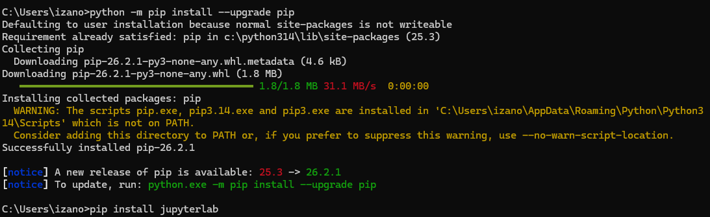

Tras este paso la añadiremos al PATH a través de la sección "Editar las variables de entorno del sistema" > Variables de entorno > Variables del sistema > PATH > Editar.

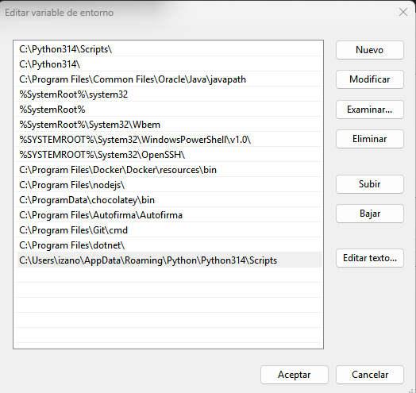

### Instalación

Para comprobar que se ha añadido correctamente al PATH reabriremos nuestra consola CMD de nuevo y ejecutaremos `jupyter lab`, si todo sale bien se abrirá automáticamente en nuestro navegador por defecto (en mi caso Brave) JupyterLab listo para usar.

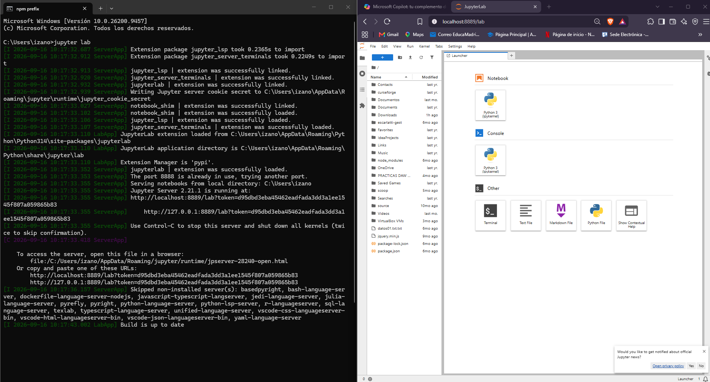

### Instalación de Almond Kernel

Para la instalación primero deberemos de comprobar que tenemos instalados tanto Scala 2.12.21 como Java 17, este último debe ser la versión 17 ya que es la versión más nueva con la que puede haber compatibilidad con la versión de Scala deseada. Estas instalaciones las realizaremos con winget junto con la instalación de Coursier, el instalador que se encargará de gestionar Almond Kernel.

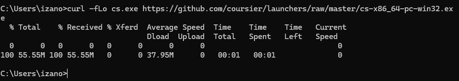

Al querer una versión concreta de Scala también usaremos Coursier para fijar la versión deseada en la instalación.

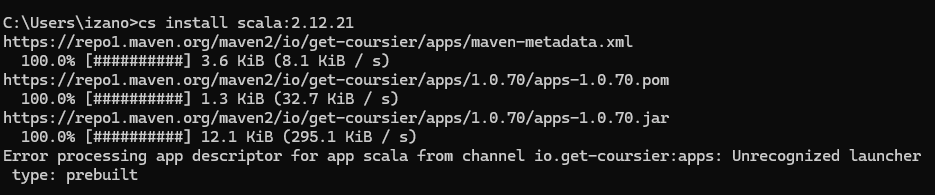

Al haber tenido problemas con la instalación de Scala procederemos a descargar la versión exacta en la página oficial de Scala (https://www.scala-lang.org/download/2.12.21.html) en formato ZIP y descomprimiremos en la raíz de nuestro disco duro. Una vez hecho esto descomprimiremos el archivo y añadiremos el bin en el PATH.

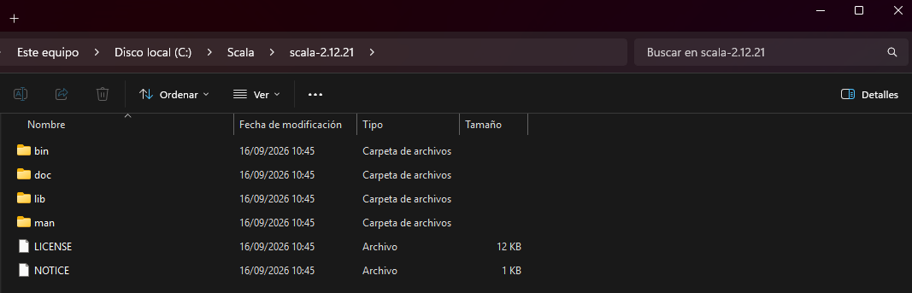

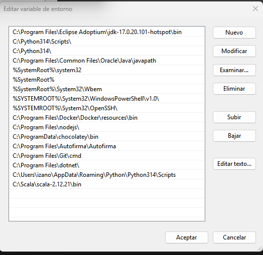

Al seguir con el problema (Windows sin detectar scala) descargaremos de la página oficial el instalador .msi, el cual nos producirá una carpeta en los Archivos de programa (x86), dicha carpeta deberá de ser referenciada en el PATH como en la anterior captura.

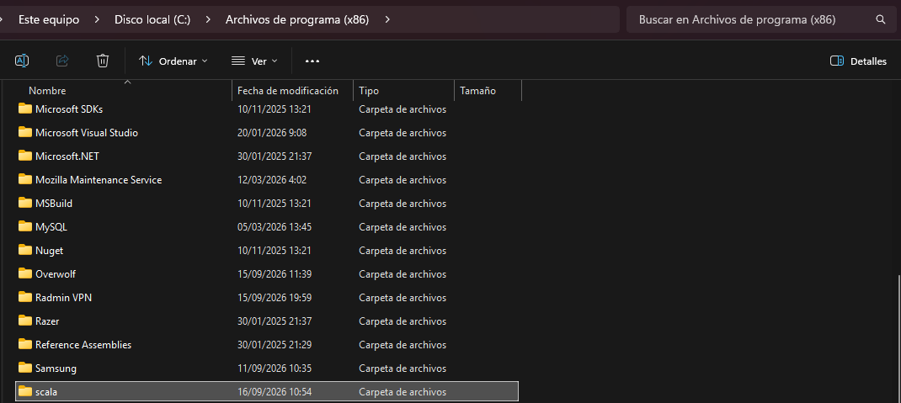

Si todo ha funcionado correctamente desde la consola Windows detectará Scala.

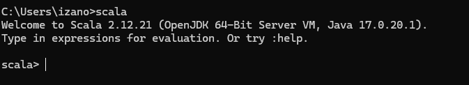

Por último, pasaremos con la instalación de Almond Kernel, la cual se realizará con Coursier. Si todo funciona correctamente podremos ver en JupyterLab la opción para crear un Notebook o Console con Scala.

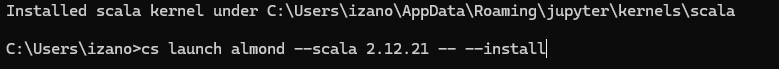

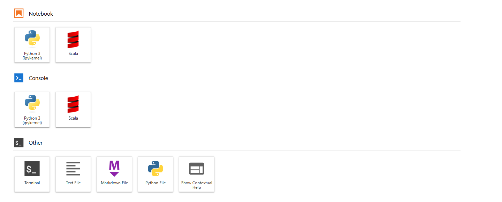

Verificaremos la versión de Scala antes de pasar a ejecutar código.

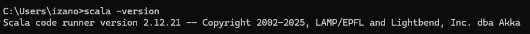

Al ver que es la versión que deseamos procederemos a comprobar el uso de Scala con una nueva notebook donde añadiremos varios ejemplos puestos por el profesor.

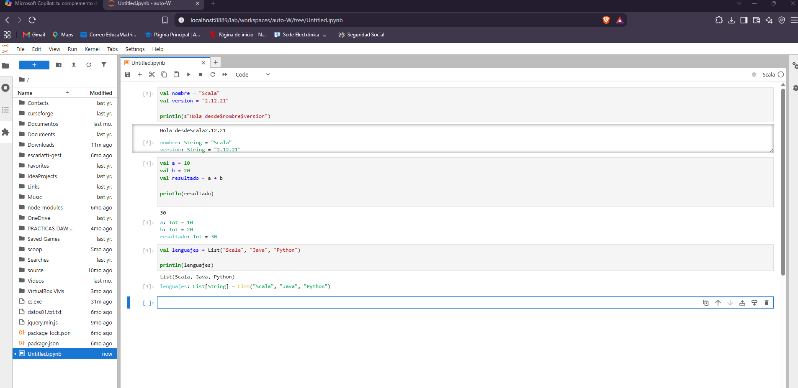

---

## ENTORNO 2

### Instalar JDK 17

Realizaremos la instalación de Java con el comando que anteriormente usamos en el Entorno 1, comprobaremos la versión tras la instalación.

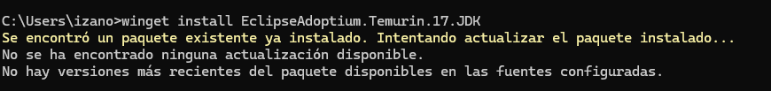

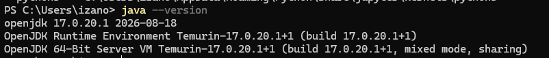

### Instalar VS Code

Realizaremos la instalación a través de la página oficial, una vez descargado el ejecutable lo ejecutaremos e iniciaremos la aplicación.

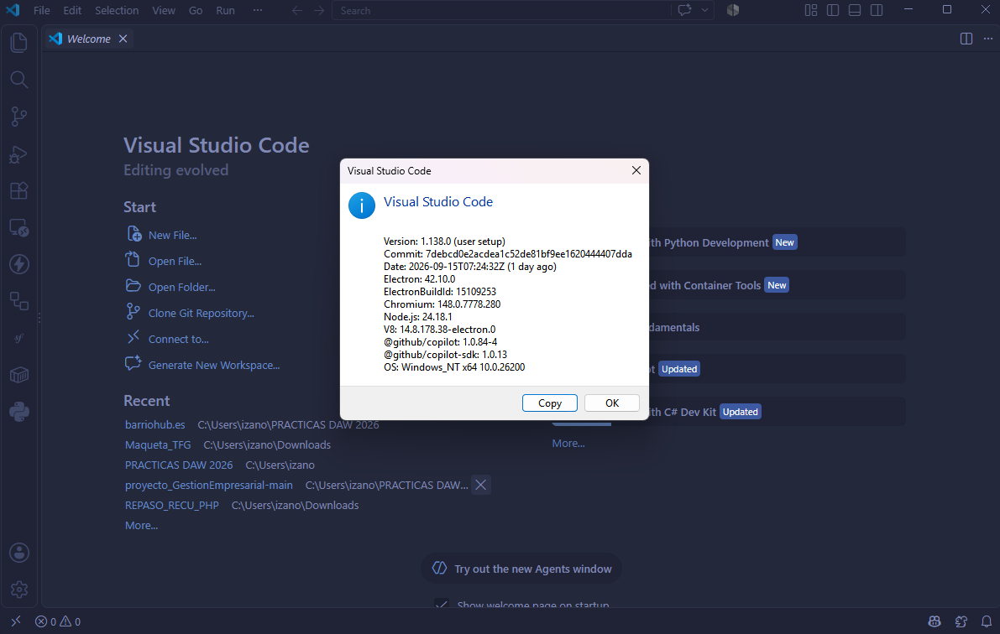

### Instalar Metals

Para descargar Metals desde VS Code es muy sencillo, lo único que deberemos de hacer es buscarlo en el buscador de extensiones e instalarlo como aparece en la siguiente imagen.

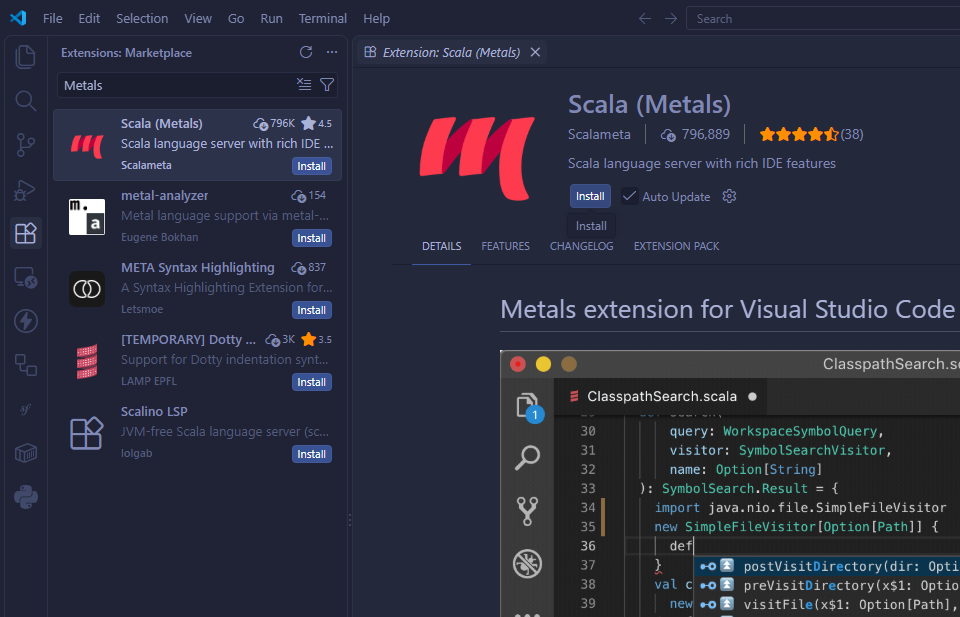

Una vez instalado podremos visualizar nuestra extensión y su versión en el apartado Extensiones.

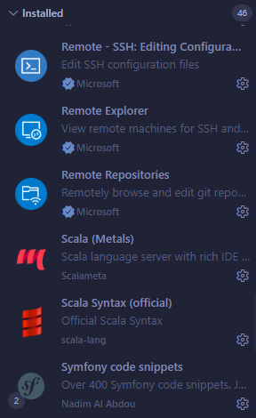

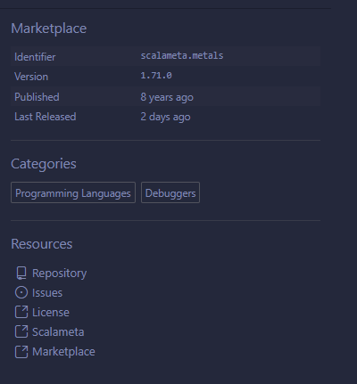

### Instalar sbt

Para instalar sbt deberemos de dirigirnos a la página oficial de Scala y allí instalar la versión más reciente con la extensión .msi.

Una vez lo ejecutemos nos pedirá permisos para instalarlo, cosa que le otorgaremos para seguir con la instalación.

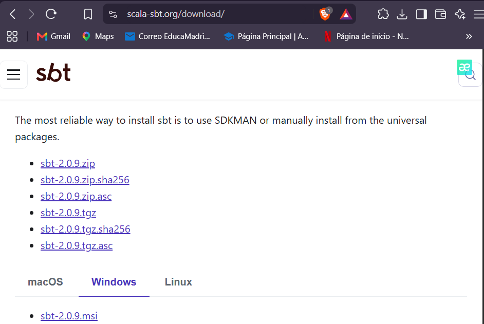

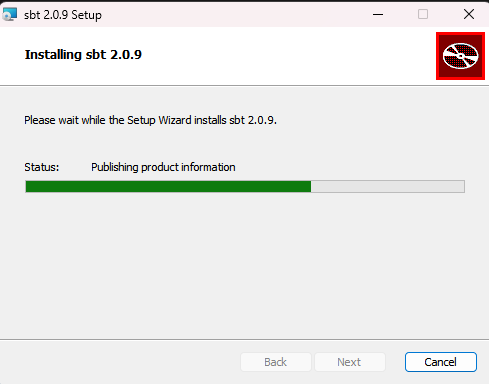

Si la instalación ha salido bien entonces tendremos respuesta en consola al pedirle `sbt --version`.

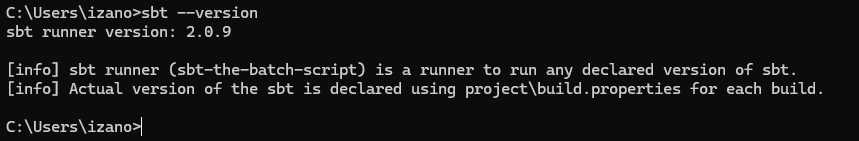

### Comprobación del Entorno

Para realizar la comprobación crearemos una carpeta para realizar las pruebas con la estructura solicitada.

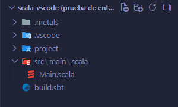

Dentro de `build.sbt` realizaremos la configuración deseada.

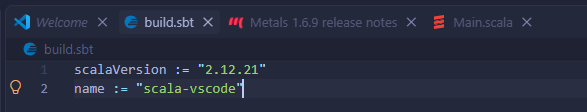

Crearemos un pequeño programa de prueba que compilaremos con sbt.

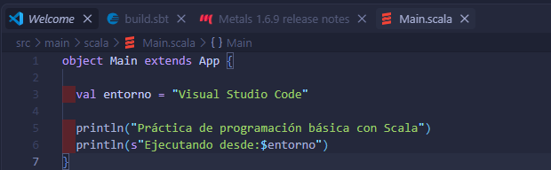

### Importar el proyecto con Metals

Comprobamos que la importación se ha realizado correctamente desde el Output de VS Code, la importación se hace nada más crear el proyecto (en mi caso) y se hace automáticamente, también deberemos pulsar Import Build al abrir el proyecto (aparecerá una ventana abajo a la derecha con esta opción para importar sbt).

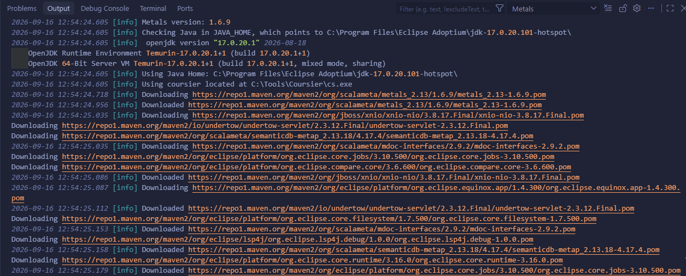

Si todo ha salido bien podremos ver que tanto `sbt compile` como `sbt run` funcionarán correctamente.

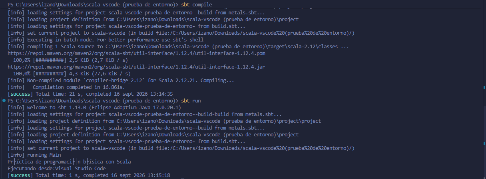

---

## ENTORNO 3

### Instalación de IntelliJ IDEA Community Edition

Deberemos dirigirnos a la página oficial del IDE donde podremos conseguir el instalador más reciente del programa, tras ejecutarlo podremos usar el programa buscándolo en nuestra barra de búsquedas.

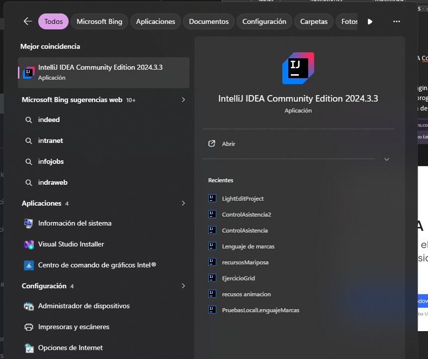

### Instalar soporte para Scala

IntelliJ es muy similar a VS Code en este aspecto, deberemos de dirigirnos a Configuración > Plugins y buscar el plugin deseado (en este caso Scala).

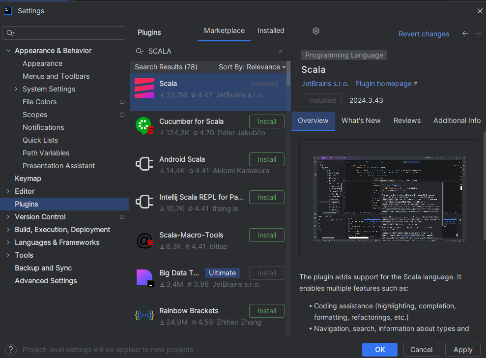

### Configurar JDK 17

Para configurar la versión de Java que usaremos en el IDE deberemos de realizar el atajo Ctrl + Alt + Shift + S para abrir "Project Structure for New Projects", nos dirigiremos al apartado Project en Project Settings para elegir tanto el SDK como el Language Level.

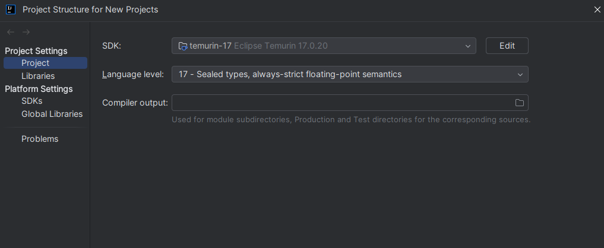

### Creación proyecto sbt

Crearemos un nuevo proyecto con sbt con el nombre deseado, con JDK 17 y Scala 2.12.21, una vez configurado pulsaremos Create.

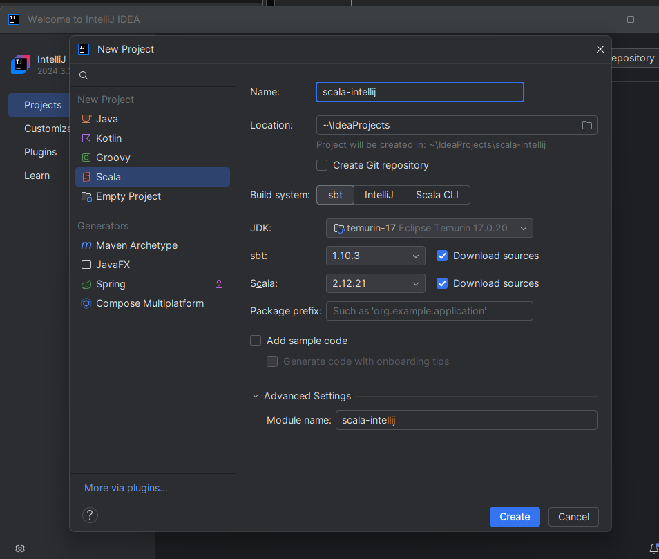

Para comprobar que las versiones de Scala que hemos escogido son las que se están aplicando podremos echar un vistazo al `build.sbt`, donde quedarán reflejadas.

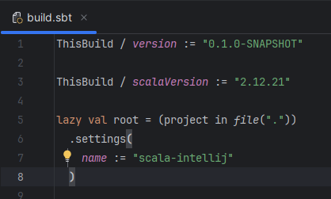

### Pruebas con el entorno

Usaremos el siguiente archivo Main para realizar las pruebas para comprobar si hemos configurado el IDE correctamente.

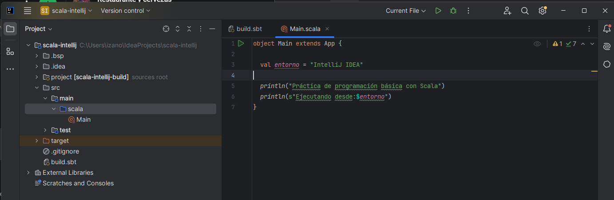

Si nos dirigimos al botón de play ubicado en la primera línea podremos probar nuestro proyecto, si todo sale bien la consola nos devolverá nuestros resultados sin ningún error.

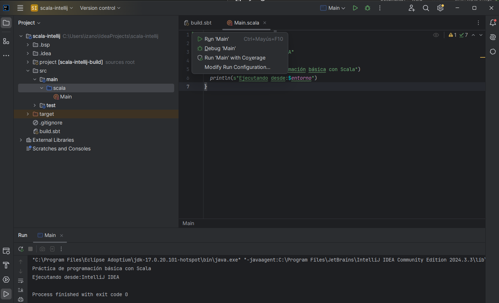

También podremos comprobar el funcionamiento de nuestro proyecto desde la consola de IntelliJ ubicada abajo a la izquierda usando sbt.

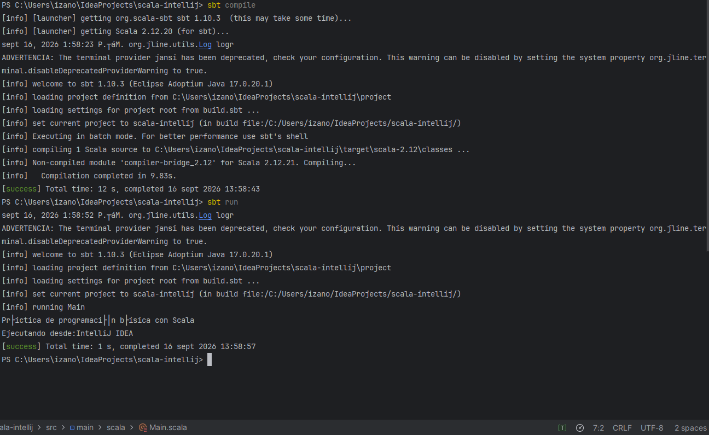
