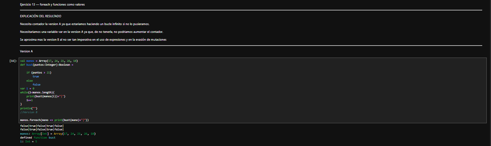
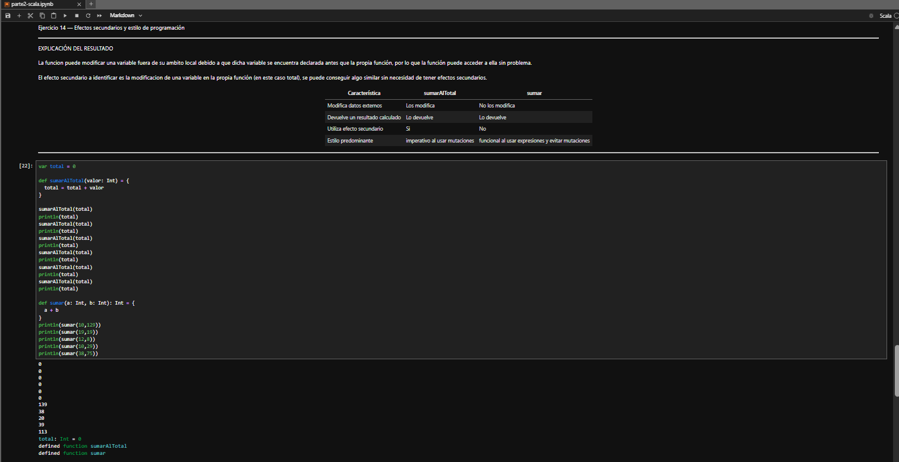
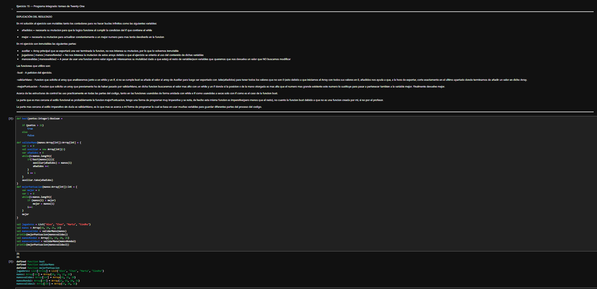
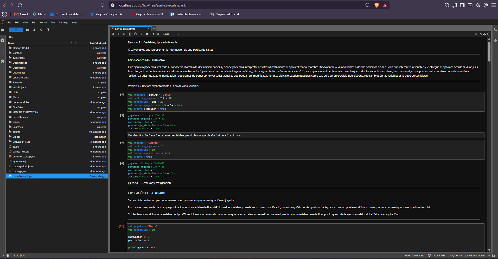
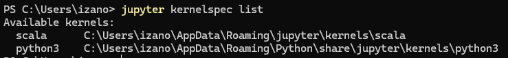
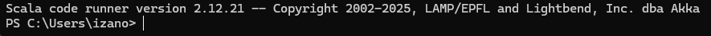

# Parte 2 – Programación con Scala

## Entorno utilizado

- JupyterLab
- Almond Kernel
- Scala 2.12.21

## Contenido

Esta parte contiene 15 ejercicios de programación realizados en Scala utilizando JupyterLab.

## Notebook

[Ver Notebook de la Parte 2](parte2-scala.ipynb)

## Evidencias

